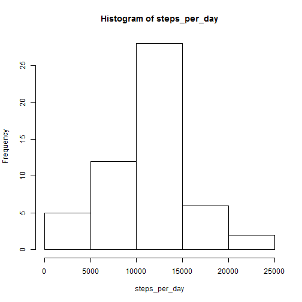

# Reproducible Research: Peer Assessment 1


## Loading and preprocessing the data

After unzipping the file downloaded from the web-course site.

```r
data <- read.csv("C:/Users/Seif/Documents/GitHub/RepData_PeerAssessment1/activity.csv")
attach(data)
```


## What is mean total number of steps taken per day?

```r
steps_per_day <- aggregate(steps ~ date, data, sum)$steps
hist(steps_per_day)
```

 


## What is the average daily activity pattern?


## Imputing missing values


## Are there differences in activity patterns between weekdays and weekends?
