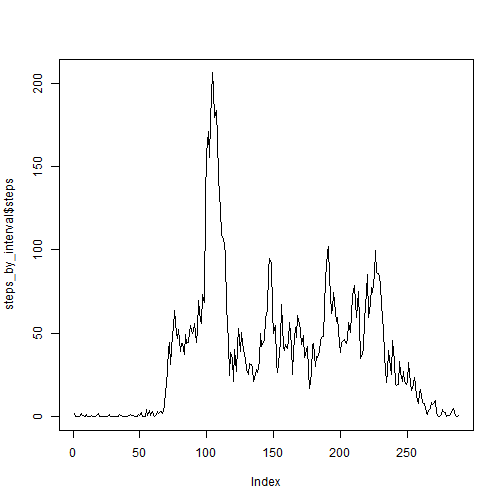
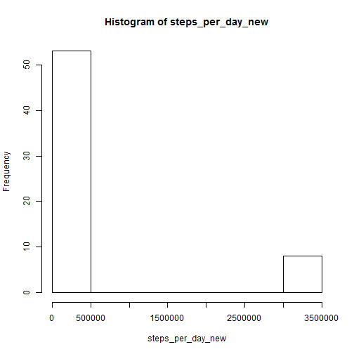
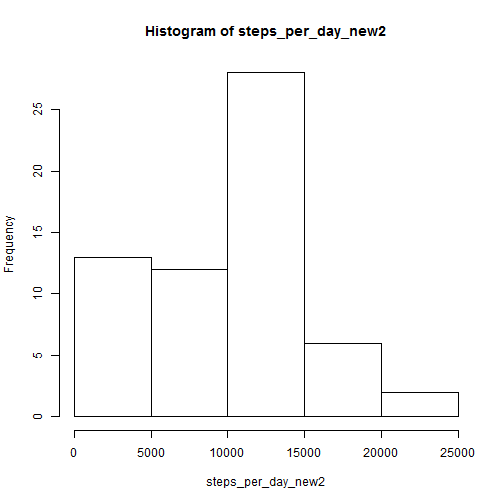

# Reproducible Research: Peer Assessment 1


## Loading and preprocessing the data

After unzipping the file downloaded from the web-course site.

```r
data <- read.csv("C:/Users/Seif/Documents/GitHub/RepData_PeerAssessment1/activity.csv")
```


## Q.1 What is mean total number of steps taken per day?

```r
steps_per_day <- aggregate(steps ~ date, data, sum)$steps
hist(steps_per_day)
```

 


### To calculate the mean:

```r
mean_of_data <- mean(steps_per_day)
mean_of_data
```

```
## [1] 10766
```


### To calculate the median:

```r
median(steps_per_day)
```

```
## [1] 10765
```


## Q.2 What is the average daily activity pattern?

```r
steps_by_interval <- aggregate(steps ~ interval, data, mean)
plot(steps_by_interval$steps, type = "l")
```

 


Row of interval with highest mean steps


```r
max_interval = which.max(steps_by_interval$steps)
max_interval
```

```
## [1] 104
```


## Q.3 Imputing missing values

Total number of missing values in the dataset (i.e. the total number of rows with NAs)

```r
sum(is.na(data$steps))
```

```
## [1] 2304
```


### Devise a strategy for filling in all of the missing values in the dataset.

We can fill the missing values with the average of each day


```r
## b <- steps_per_day <- aggregate(steps ~ date, data, sum)$steps na_indices
## <- which(is.na(data$steps)) s <- split(data, data$date)

```

### I couldn't fill the values with the mean of each day, instead I will fill it with the mean of the whole finding 

```r
## create a duplicate, let's call it tmp for now
tmp <- read.csv("C:/Users/Seif/Documents/GitHub/RepData_PeerAssessment1/activity.csv")
tmp$steps[is.na(tmp$steps)] <- mean_of_data
```


```r
steps_per_day_new <- aggregate(steps ~ date, tmp, sum)$steps
hist(steps_per_day_new)
```

 


### To calculate the mean:

```r
mean_of_data_new <- mean(steps_per_day_new)
mean_of_data_new
```

```
## [1] 415998
```


### To calculate the median:

```r
median(steps_per_day_new)
```

```
## [1] 11458
```


### Another possible solution is to fill NA with 0

```r
## create another duplicate, let's call it tmp2 for now
tmp2 <- read.csv("C:/Users/Seif/Documents/GitHub/RepData_PeerAssessment1/activity.csv")
tmp2$steps[is.na(tmp2$steps)] <- 0
```


```r
steps_per_day_new2 <- aggregate(steps ~ date, tmp2, sum)$steps
hist(steps_per_day_new2)
```

 


### To calculate the mean:

```r
mean_of_data_new2 <- mean(steps_per_day_new2)
mean_of_data_new2
```

```
## [1] 9354
```


### To calculate the median:

```r
median(steps_per_day_new2)
```

```
## [1] 10395
```


### As expected the values shift to bigger values when replacing the NA with the mean of the values, and the values shift to smaller when replacing the NA with a 0 value


## Are there differences in activity patterns between weekdays and weekends?

